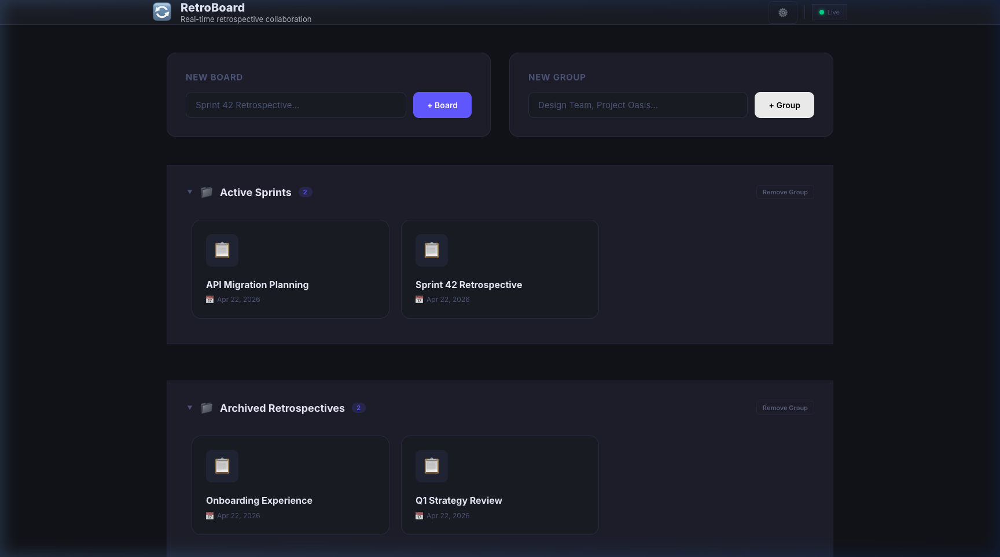
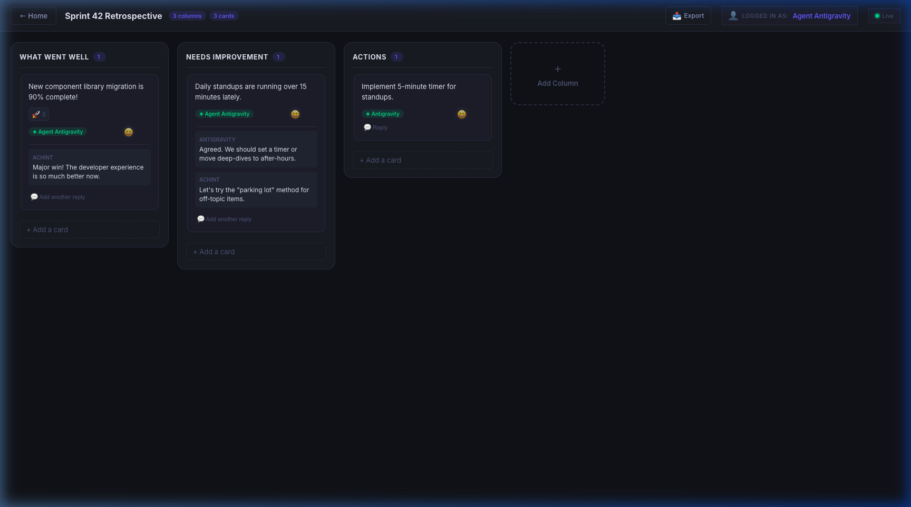

# Retrospective Board 🔄

A **self-hosted, real-time retrospective board** for agile teams. Open-source, MIT-licensed, deployable locally or as a Docker image — no account required.

## Preview

### Dashboard (Dynamic Workspace)


### Board Interface (High Fidelity)


## Features

- 📋 **Flexible Organization**: Create board groups and categorize your retrospectives into custom workspaces.
- 🌈 **Theme Customization**: Tailor the interface to your preference with primary and secondary color controls.
- ⚡ **Real-time Collaboration**: Instant sync across all connected clients via Socket.IO.
- 🃏 **Rich Card Interactions**: Drag-and-drop movement, reactions, and threaded replies with image support.
- 🕵️ **Anonymity Options**: Post cards anonymously or with your name for safe feedback.
- 📤 **Advanced Export**: Save your board state as clean **Markdown** or high-fidelity **PDF** snapshots.
- 💾 **Persistent Storage**: Robust data preservation using SQLite.
- 🐳 **One-Click Deployment**: Docker-ready, single-container deployment or Docker Compose.

## Tech Stack (all MIT-licensed)

| Layer | Technology |
|-------|-----------|
| Frontend | React 18 + Vite |
| Real-time | Socket.IO |
| Backend | Node.js + Express |
| Database | SQLite (sqlite3) |
| Drag & Drop | @hello-pangea/dnd |
| Container | Docker |

---

## Local Development

### Prerequisites
- Node.js ≥ 18
- npm

### Install all dependencies
```bash
npm install          # root (concurrently)
cd server && npm install && cd ..
cd client && npm install && cd ..
```

### Start everything with one command
```bash
npm run dev
```

This starts both the backend (port 3001) and the Vite dev server (port 5173) in a single terminal with colour-coded output. Open **http://localhost:5173** in your browser.

> The Vite dev server proxies `/api` and `/socket.io` to the backend automatically.


---

## Production (Docker)

### Single container
```bash
docker build -t retro-board .
docker run -p 3001:3001 -v retro-data:/app/data retro-board
```

### With Docker Compose
```bash
docker compose up -d
```

Open **http://localhost:3001** in your browser.

---

## Configuration

| Environment variable | Default | Description |
|---|---|---|
| `PORT` | `3001` | Server port |
| `DATA_DIR` | `./data` | SQLite database directory |
| `CLIENT_URL` | `*` | Allowed CORS origin |

---

## AI Agent Connectivity (MCP)

This platform includes a built-in **Model Context Protocol (MCP)** server, allowing AI agents (like Claude Desktop) to interact with your retrospective boards directly.

### Features for Agents:
- **Read Boards**: Pull board content as structured Markdown or raw JSON.
- **Collaborate**: Agents can add or delete cards (updates reflect instantly in the web UI).
- **Summarize**: Dedicated tools for board analysis.

### Connecting Claude Desktop:
Add the following to your `claude_desktop_config.json`:

```json
{
  "mcpServers": {
    "retro-board": {
      "url": "http://localhost:3001/mcp"
    }
  }
}
```

*Note: Replace `localhost:3001` with your actual server address if hosting remotely.*

---


## License

MIT © RetroBoard Contributors
