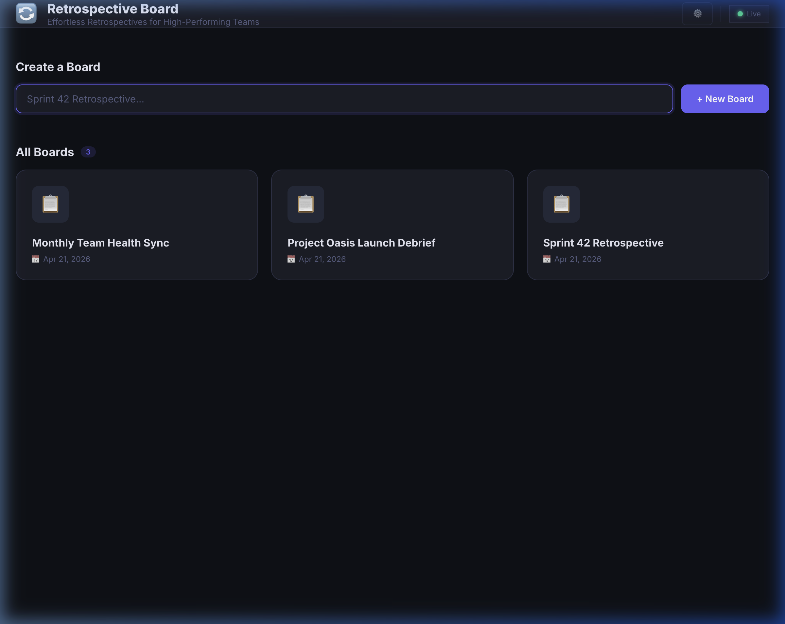
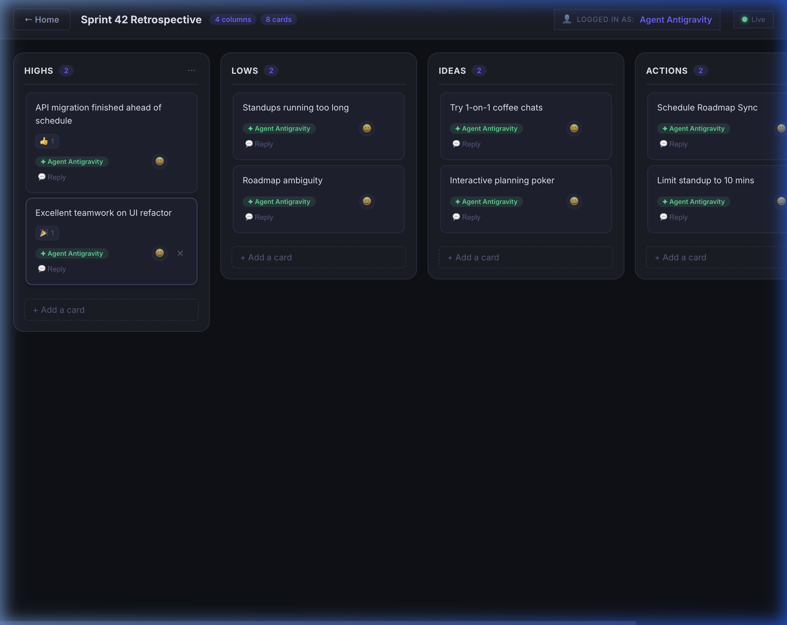

# Retrospective Board 🔄

A **self-hosted, real-time retrospective board** for agile teams. Open-source, MIT-licensed, deployable locally or as a Docker image — no account required.

## Preview

### Dashboard (Grid View)


### Board Interface


## Features

- 📋 Create & delete boards
- ➕ Add & delete columns
- 🃏 Add, move (drag-and-drop), and delete cards
- 🕵️ Post cards anonymously or with your name
- ⚡ Real-time sync across all connected clients (Socket.IO)
- 💾 Persistent SQLite storage
- 🐳 Docker-ready, single-container deployment

## Tech Stack (all MIT-licensed)

| Layer | Technology |
|-------|-----------|
| Frontend | React 18 + Vite |
| Real-time | Socket.IO |
| Backend | Node.js + Express |
| Database | SQLite (sqlite3) |
| Drag & Drop | @hello-pangea/dnd |
| Container | Docker |

---

## Local Development

### Prerequisites
- Node.js ≥ 18
- npm

### Install all dependencies
```bash
npm install          # root (concurrently)
cd server && npm install && cd ..
cd client && npm install && cd ..
```

### Start everything with one command
```bash
npm run dev
```

This starts both the backend (port 3001) and the Vite dev server (port 5173) in a single terminal with colour-coded output. Open **http://localhost:5173** in your browser.

> The Vite dev server proxies `/api` and `/socket.io` to the backend automatically.


---

## Production (Docker)

### Single container
```bash
docker build -t retro-board .
docker run -p 3001:3001 -v retro-data:/app/data retro-board
```

### With Docker Compose
```bash
docker compose up -d
```

Open **http://localhost:3001** in your browser.

---

## Configuration

| Environment variable | Default | Description |
|---|---|---|
| `PORT` | `3001` | Server port |
| `DATA_DIR` | `./data` | SQLite database directory |
| `CLIENT_URL` | `*` | Allowed CORS origin |

---

## License

MIT © RetroBoard Contributors
