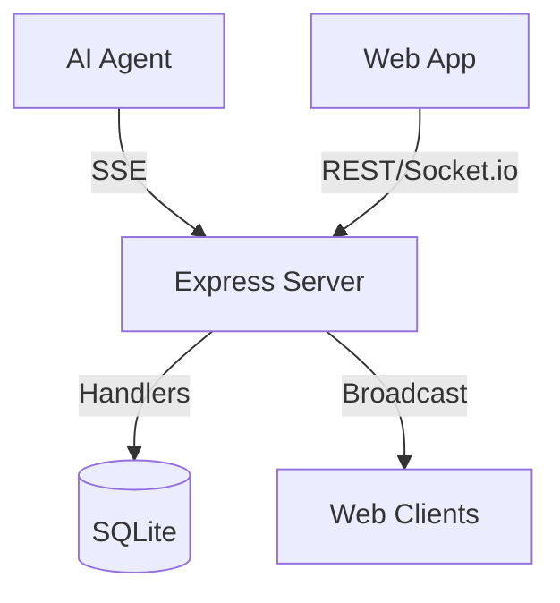

# Design - MCP Server Integration

## Technical Architecture
The MCP server will be integrated directly into the `server/src/index.js` Express application using the `@modelcontextprotocol/sdk`.

### MCP/SSE Bridge
We will use `SSEServerTransport` from the MCP SDK.
- **`GET /mcp`**: Establish the SSE connection.
- **`POST /mcp/messages`**: Handle incoming JSON-RPC messages from the client.

### Resource Definitions
- **Boards List (`retro://boards`)**:
  - Implementation: Calls `dbAll('SELECT id, name FROM boards')`.
  - Output: JSON array of board metadata.
- **Board Markdown (`retro://boards/{id}/md`)**:
  - Implementation: Reuses the logic from `client/src/utils/MarkdownExport.js` (refactored into a shared utility or a server-side version).
  - Output: A clean Markdown string of the board content.
- **Full Board State (`retro://boards/{id}/full`)**:
  - Implementation: Calls `getBoardState(id)`.
  - Output: Complete JSON object.

### Tool Definitions
- **`add_card(boardId, columnId, content, author)`**:
  - Action: Inserts record into `cards` table.
  - Bridge: Emits `card-added` event via `io.to(boardId).emit(...)`.
- **`delete_card(cardId)`**:
  - Action: Deletes from `cards` table.
  - Bridge: Emits `card-deleted` event.
- **`summarize_board(boardId)`**:
  - Action: Fetches the Markdown resource and provides it to the agent with a system prompt for summarization.

## Dependency Changes
- **New Dependency**: `@modelcontextprotocol/sdk` (Server-side).

## Data Flow

## Security & Ethics
- **Identity**: Cards added via MCP will have a default author like `AI Assistant` unless overridden.
- **Local Access**: Initially scoped to local network access to match the "Self-Hosted" nature of the app.
